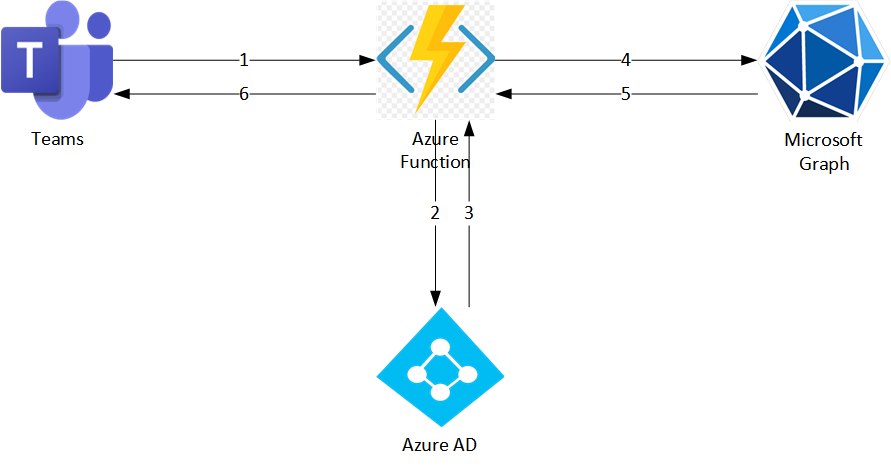
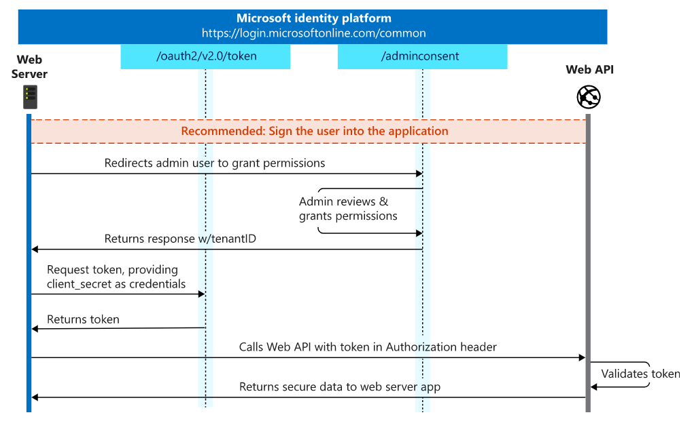

>Note: This documentation applies to TeamsFx SDK version >= 2.0.0.

## Overview

A typical Teams tab application usually needs to obtain a currently logged-in user identity to build a single sign-on experience for the application user. To access user information protected by Azure Active Directory and to access data from services like Facebook and Twitter, the application needs to establish a trusted connection with those providers. For example, if your application is calling Microsoft Graph APIs to obtain a user's profile photo, you need to authenticate the user to retrieve the appropriate authentication tokens.

## How auth code flow works in a frontend only Teams Tab application

frontend only Teams Tab application created by Teams Toolkit, we leverage the [AAD Auth Code Flow](https://docs.microsoft.com/en-us/azure/active-directory/develop/v2-oauth2-auth-code-flow) as the authentication mechanism to provide user login experience in Teams Tab apps. The template provides a simple Teams Tab that can get user login information.


The sequence chart below shows how the authentication flow works in a frontend only Teams Tab application.


> Latest TeamsFx SDK uses [msal-browser](https://www.npmjs.com/package/@azure/msal-browser) for Auth Code Flow with PKCE authentication. 


### Use TeamsFx SDK for Auth Code flow with PKCE

1. In the Teams Tab app, add the following code to trigger the login flow: 
    ```ts
    const authConfig: TeamsUserCredentialAuthConfig = {
      clientId: process.env.REACT_APP_CLIENT_ID!,
      initiateLoginEndpoint: process.env.REACT_APP_START_LOGIN_PAGE_URL!,
    };

    const teamsUserCredential = new TeamsUserCredential(authConfig);

    // Put the login code below in a call-to-action callback function to avoid browser blocking automatically showing up pop-ups.
    const scope = ["User.Read"];
    await teamsUserCredential.login(scope);
    ```

    > Note: Due to the [limitation](https://docs.microsoft.com/en-us/azure/active-directory/develop/msal-js-initializing-client-applications#single-instance-and-configuration) of msal, multiple instances of `TeamsUserCredential` is not recommended.

2. When `teamsUserCredential.login` function is triggered, TeamsFx SDK would pop up a window and navigate to auth-start.html under `tabs/public` in your project. The above code would read `REACT_APP_START_LOGIN_PAGE_URL` from env as the endpoint of auth-start.html. You can customize your endpoint by updating `initiateLoginEndpoint` of `authConfig`.
    
3. In auth-start.html, will navigate to AAD login page using [msal](https://github.com/AzureAD/microsoft-authentication-library-for-js/blob/dev/lib/msal-browser/docs/login-user.md#login-the-user).
You can find the template of auth-start.html [here](https://github.com/OfficeDev/TeamsFx/blob/main/templates/tab/js/default/public/auth-start.html) for JavaScript and [here](https://github.com/OfficeDev/TeamsFx/blob/main/templates/tab/ts/default/public/auth-start.html) for TypeScript.

4. After login in the AAD login page, user will be redirected to auth-end.html. In auth-end.html, will use [msal](https://github.com/AzureAD/microsoft-authentication-library-for-js/blob/dev/lib/msal-browser/docs/initialization.md#redirect-apis) to use Auth Code Flow with PKCE. Since msal use the session storage for [cache](https://github.com/AzureAD/microsoft-authentication-library-for-js/blob/dev/lib/msal-browser/docs/caching.md), will return session storage to SDK. The scheme of response will be:
      ```
      {
        "sessionStorage": {
          "key": "value",
          ...
        },
        ...
      }
      ``` 
You can find the template of auth-end.html [here](https://github.com/OfficeDev/TeamsFx/blob/main/templates/tab/js/default/public/auth-end.html) for JavaScript and [here](https://github.com/OfficeDev/TeamsFx/blob/main/templates/tab/ts/default/public/auth-end.html) for TypeScript.

5. TeamsFx SDK will get the response from the auth-end page, and will:
      * If the response is empty or can not parse to JSON object, will return error.
      * If "code" exists in the response, will return error. You can check [here](#how-to-solve-the-error-found-auth-code-in-response-auth-code-is-not-support-for-current-version-of-sdk) for detail.
      * If "sessionStorage" exists in the response, will set the key value pairs to the session storage.


6. After this, the login flow has been completed. You can use the following code to call Graph API: 
    ```ts
    const graphClient = createMicrosoftGraphClientWithCredential(teamsUserCredential, ["User.Read"]); 
    const profile = await graphClient.api("/me").get();
    ```

### Get Token Flow
When getting token flow is triggered, Teams SDK will first try to use msal to check whether Access Token exists in session storage. Here msal will handle the scenario that the token exists and is expired. If succeeded, return Access Token. If failed to get Access Token from session storage, Teams SDK will try to use msal to launch silent SSO. If succeeded, return Access Token. If failed in silent SSO, you need to trigger the login flow to get Access Token.


## How On-Behalf-Of flow works in Teams Tab with Azure Function backend
If your Teams Tab App has an backend service such as Azure Function application, and you want to access current user information protected by Azure Active Directory in backend service, for example, if your Azure Function needs to call Microsoft Graph APIs to obtain a user's profile photo, then you need to authenticate the user with [On-Behalf-Of flow](https://learn.microsoft.com/en-us/azure/active-directory/develop/v2-oauth2-on-behalf-of-flow) to retrieve the appropriate authentication tokens.

The sequence chart below shows how the On-Behalf-Of flow works in a Teams Tab app.



Step 1: Teams Tab App sends request with SSO token in header to Azure Function backend

Step 2,3: Azure Function calls Azure AD use OBO flow to exchange access token for Graph API

Step 4,5: Azure Function use access token to call Graph API

Step 6: Azure Function send back result to Teams Tab


> Latest TeamsFx SDK uses [msal-node](https://www.npmjs.com/package/@azure/msal-node) for On-Behalf-Of flow authentication.

### Use TeamsFx SDK for On-Behalf-Of flow
1. To call Azure Function to get user information, the Teams Tab client sends an HTTP request with an SSO token in the `Authorization` header. The token can be retrieved using the TeamsFx SDK from your app's client (custom tab). Below is an example:

  ```ts
  const authConfig: TeamsUserCredentialAuthConfig = {
    clientId: process.env.REACT_APP_CLIENT_ID!,
    initiateLoginEndpoint: process.env.REACT_APP_START_LOGIN_PAGE_URL!,
  };

  const teamsUserCredential = new TeamsUserCredential(authConfig);
  const accessToken = await teamsUserCredential.getToken("");

  // note: empty string argument on the previous line is required for now, this will be fixed in a later release
  const response = await fetch(`${functionEndpoint}/api/${functionName}`, {
    headers: {
      Authorization: `Bearer ${accessToken.token}`,
    },
  });
  ```

2. In the Azure Function app,  use `OnBehalfOfUserCredential` to call Graph API for current user using `ssoToken` retrieved from request header as below:

    ```ts
    const authConfig: OnBehalfOfCredentialAuthConfig = {
      authorityHost: config.authorityHost,
      tenantId: config.tenantId,
      clientId: config.clientId,
      clientSecret: config.clientSecret,
    };
    let credential = new OnBehalfOfUserCredential(ssoToken, authConfig);

    const graphClient: Client = createMicrosoftGraphClientWithCredential(credential, [".default"]);
    const profile: any = await graphClient.api("/me").get();
    ```
    > Note: `ssoToken` is retrieved from request header

3. When Graph API is called, if user doesn't consent before, it will throw error. Then Teams Tab app needs to show login button and ask user to consent the permission as below:
    ```ts
    const authConfig: TeamsUserCredentialAuthConfig = {
      clientId: process.env.REACT_APP_CLIENT_ID!,
      initiateLoginEndpoint: process.env.REACT_APP_START_LOGIN_PAGE_URL!,
    };

    const teamsUserCredential = new TeamsUserCredential(authConfig);

    // Put the login code below in a call-to-action callback function to avoid browser blocking automatically showing up pop-ups.
    const scope = ["User.Read"];
    await teamsUserCredential.login(scope);
    ```

## How client credentials flow (application credential) works in Teams Tab with Azure Function backend
In the [client credentials flow](https://learn.microsoft.com/en-us/azure/active-directory/develop/v2-oauth2-client-creds-grant-flow), permissions are granted directly to the application itself by an administrator. When the app presents a token to a resource, the resource enforces that the app itself has authorization to perform an action since there is no user involved in the authentication.


The entire client credentials flow looks similar to the following diagram as below:



> Latest TeamsFx SDK uses [msal-node](https://www.npmjs.com/package/@azure/msal-node) for On-Behalf-Of flow authentication.


### Use TeamsFx SDK for client credentials flow
1. Grant application permission in the AAD application follow this [link](https://learn.microsoft.com/en-us/azure/active-directory/develop/quickstart-configure-app-access-web-apis#application-permission-to-microsoft-graph).

2. After permissions are granted, then in the Azure Function, use `AppCredential` in TeamsFx SDK to call Graph API as below:

  ```ts
  const appAuthConfig: AppCredentialAuthConfig = {
    authorityHost: process.env.M365_AUTHORITY_HOST,
    clientId: process.env.M365_CLIENT_ID,
    tenantId: process.env.M365_TENANT_ID,
    clientSecret: process.env.M365_CLIENT_SECRET,
  };

  const appCredential = new AppCredential(appAuthConfig);
  const graphClient: Client = createMicrosoftGraphClientWithCredential(appCredential, [".default"]);
  const profile: any = await graphClient.api("/users/" + userName).get();
  ```


## References
- This sample demonstrate auth flows using TeamsFx SDK: [Hello World Tab with Backend Sample](https://github.com/OfficeDev/TeamsFx-Samples/tree/dev/hello-world-tab-with-backend)

- [TeamsFx SDK document](https://learn.microsoft.com/en-us/microsoftteams/platform/toolkit/teamsfx-sdk)
